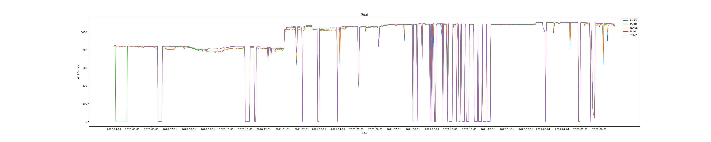
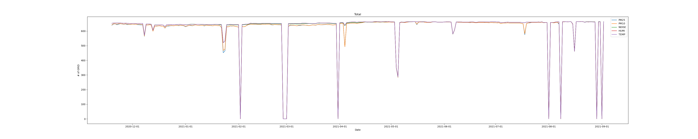
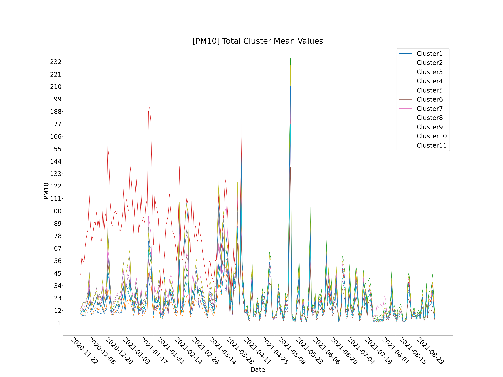
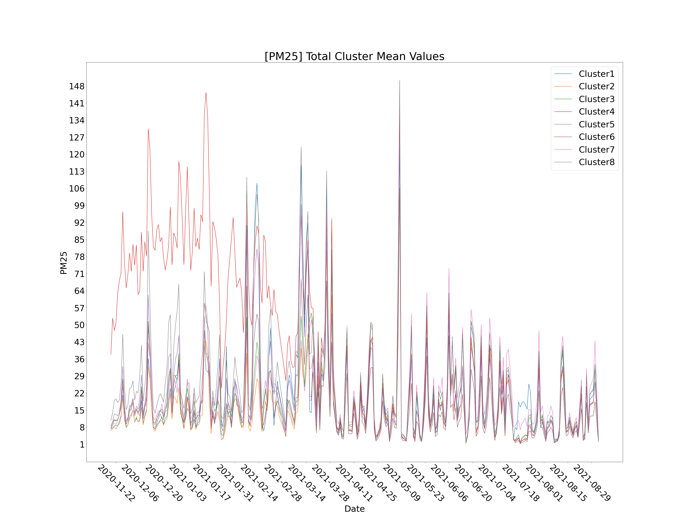
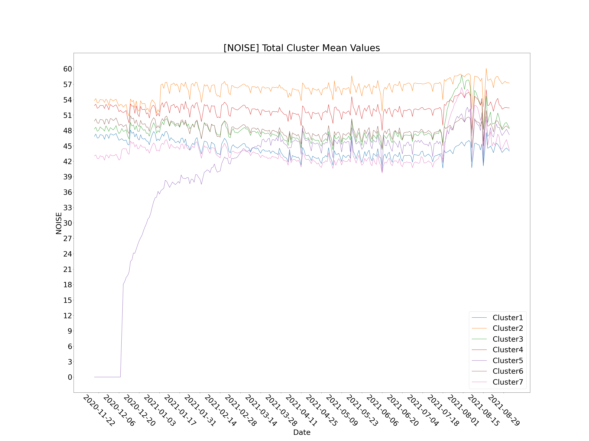
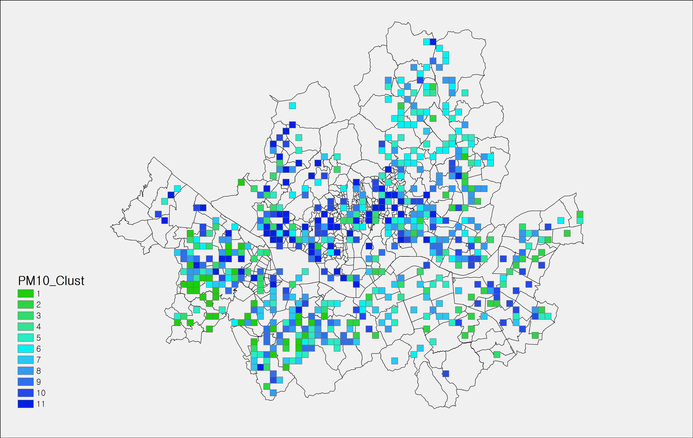
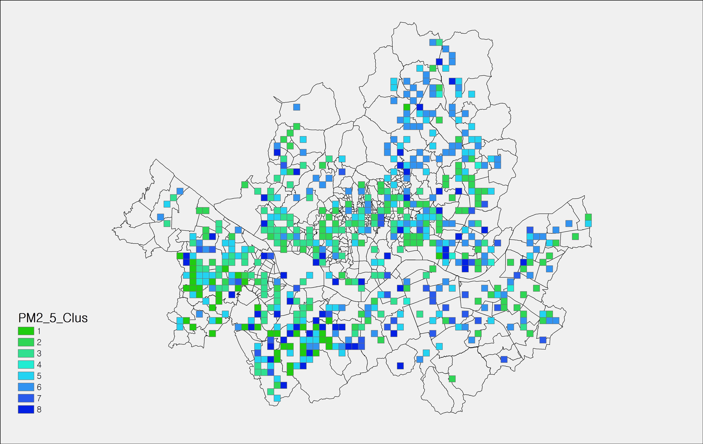
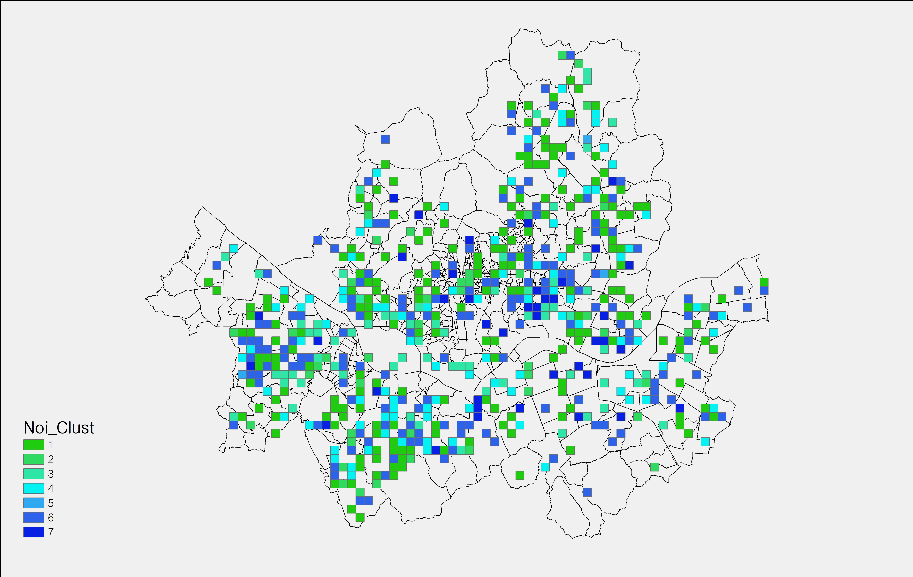

# 서울시 생활환경별 특징과 그에 영향을 미치는 도시계획 특성 분석

## 목적
* 본 연구는 주민 생활과 직접적으로 연계되는 미세먼지, 소음, 진동 등 여러 생활환경 양상을 면밀히 파악
* 그 양상과 도시계획적 요소 간의 관계를 파악하여 지속 가능한 도시 공간 조성을 위한 방향성 제언

## 데이터 
* 2020년 4월 1일부터 2022년 6월 26일까지 S-Dot 데이터(초미세먼지, 미세먼지, 소음 등)
* 수집한 1시간 단위 데이터를 1일 단위로 전처리하는 과정에서 1시그마 외의 데이터는 이상치로 정의하여 제거하였으며, 센서 당 1일 평균 값으로 데이터 전처리

* 서울시 전역 500m x 500m 단위로 GRID(2,628개)를 나눈 후 각 GRID에 속한 S-Dot 센서들의 평균값을 각 GRID의 대푯값으로 정의
* 빈데이터가 없는 최대한의 기간(2020년 11월 19일부터 2021년 9월 2일)의 GRID(612개)를 최종분석에 사용

## 분석방법
* 선형 보관법을 사용하여 결측치를 채워 넣었으며, 시계열 클러스터 분석을 하기 위해 Time Series K-Means를 사용
* EDA(Explatory Data Analysis)분석, multi-way ANOVA 분석, OLS(Ordinay Least Squares, 최소자승법 회귀분석)분석, MNL(Multi-Nominal Logisti0c Regression, 다항로지스틱 회귀분석)분석 수행

## 분석결과
* 각 생활환경 데이터 별 Time Series K-Means 결과

* 각 생활환경 데이터 별 생활환경지도

** 본 연구는 2022년도 서울 데이터 펠로우십에 지원에 의한 연구임을 밝힙니다.
